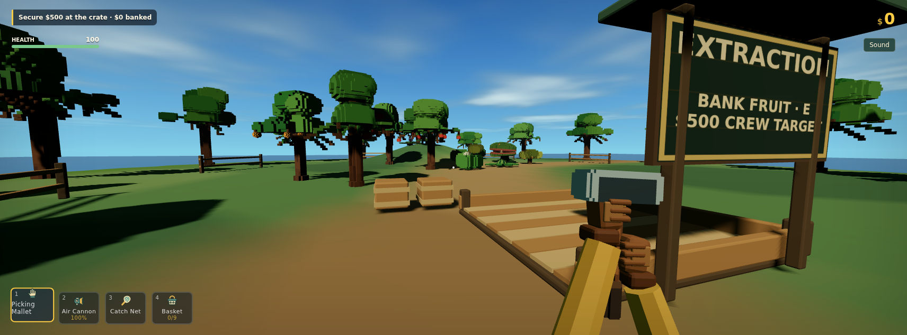
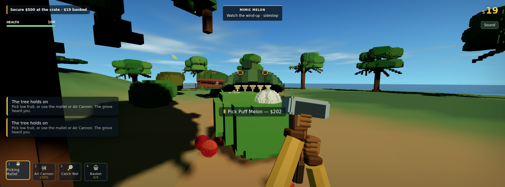
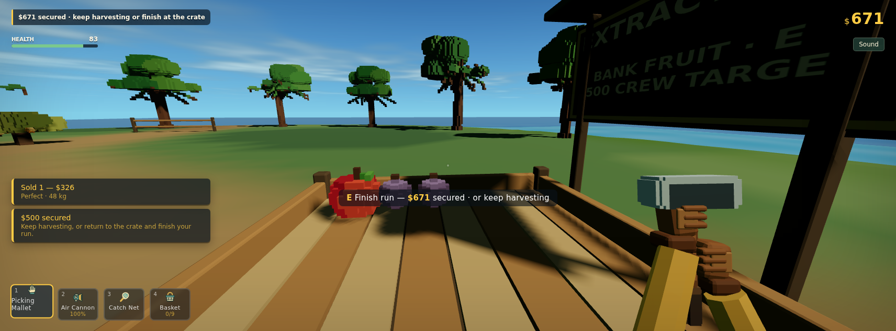
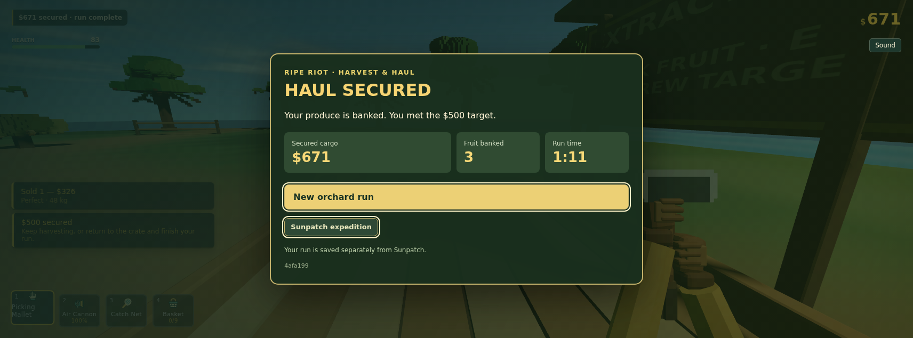
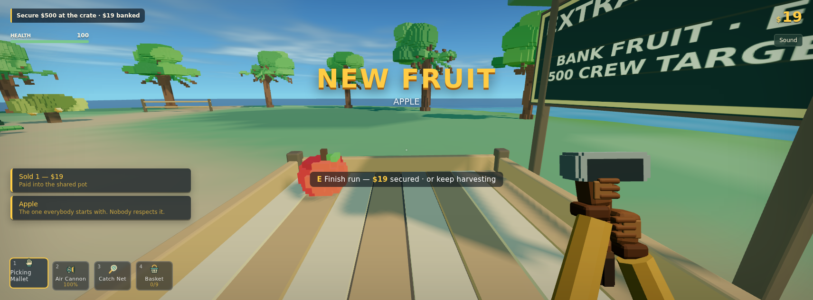
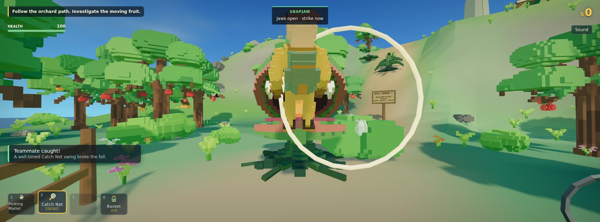
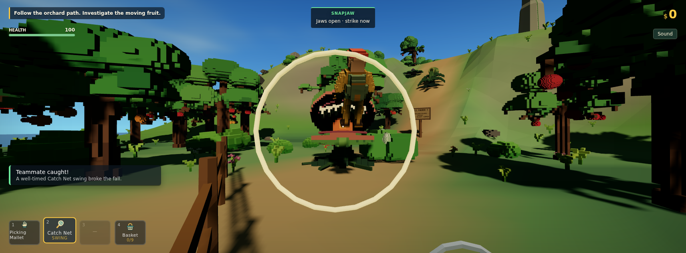

# Orchard extraction evidence — 2026-10-01 to 2026-10-02

## Build and scope

Gameplay source: `4afa19998851c2a6f649f81bb3f773882e138b99`, branch `codex/sunpatch-chaos-combat`.

This pass implements the linked **Analyze Fishing Game** chat's recommended first experiment: one compact harvest-extraction clearing, three available tools, physical fruit interactions, harvest-triggered warning/burst/rest, and a $500 shared cargo target. It does not claim that the full expedition pivot or human fun/pacing has been approved.

Frozen local preview: `http://127.0.0.1:5287/?orchardRun=1`, copied build in `capture/orchard-preview-4afa199/`. Original active checkout/session was left untouched. Automated browser input ran on GitHub's Linux runners only.

## Verified

| Check | Evidence |
|---|---|
| Browser-free regressions | 463/463 pass, `offline-tests.log` |
| Typecheck and production build | `npm run build` passes; existing large chunk notice remains |
| Ordinary solo run | 26/26 checks; trusted input picks an authored apple, walks/banks $19, shakes the loaded tree, subdues the awakened Mimic with no cash/quota prize, then hauls two authored Boulder Plums and banks $671 total |
| Finish and reload | At $500 play remains active; empty-handed E at crate finishes, saves and reloads the same $671 / three sold IDs; repeated E does not duplicate payment |
| Shared crew banking | 33/33 checks; staged room connection only, then ordinary guest pick/walk/bank; both ledgers contain the same $19 apple once; guest E also completes a smaller haul for both peers |
| Original game scenario regressions | 20/20 scenarios pass on the same gameplay source |
| Full original expedition regression | 26/26 ordinary-input route beats pass in 444 seconds, including physical King Melon extraction, return, settlement and reload; `sunpatch-expedition-report.json` |
| Existing net rescue regression | Host and guest rescuers each pass 10/10 checks: actual fling, trusted held mouse swing, host acceptance, victim stop acknowledgement and success cue. Positions and aim are fixture-assisted; ordinary aim is not established |
| Review fixes | Real FruitSystem/Rapier join fixture repairs seed fruit after a saved guest joins another crew; reconnect accepts the host baseline after solo progress; guest plants retain the full warning before wake/rest |

Remote run: [36929805422](https://github.com/Darkgrowth/ripe-riot/actions/runs/36929805422).
Supplemental rescue run: [37001289385](https://github.com/Darkgrowth/ripe-riot/actions/runs/37001289385), QA commit `94ec35c`. Game source is unchanged from `4afa199`; only the test harness/workflow changed. Remote Xvfb with normal frame pacing resolves the headless guest's slow simulation and late pointer recenter. The bounded fixture aim pin preserves the already assigned pose; real primary input, physics, sweep and production catch guards remain active.
Solo and co-op report files preserve individual checks, actual banked IDs/values, events and input timeline. Room connection is explicitly fixture setup. Fruit is never spawned, positions/aim never assigned, input never synthesized, and money/finish never set through debug in the Orchard ordinary-input proof.

## Visual inspection

Inspected normal gameplay-camera captures at 1712×634: opening clearing/crate, awakened harvest pocket, banked cargo, results, and guest cargo. The approved rounded voxel style is reused. The bin visibly fills with the actual banked species, prompts expose the correct cargo/finish action, and results show the saved haul.

## Limits

Remote `--logic-only` keeps real rAF, physics, input, UI and networking, but draws only for explicit captures. It is not continuous-render or hardware performance acceptance. The optimized fixture finishes far faster than a first-time human; it does not establish a 5–10 minute fun loop.

Boulder/Glue swept contacts, interruptions, cooldown, cover and authority are covered by browser-free model/system tests. Deliberate human throws, net rescue in the new clearing, first-time guidance and fun remain human-playtest concerns. Reusable net rescue is verified separately in the existing Sunpatch fixture, with staged position/aim and freeze only after the actual acknowledged success cue. Original failed logs are retained locally in `capture/orchard-diagnostics/`; successful reports and captures are durable here. Production catch guards are unchanged.

